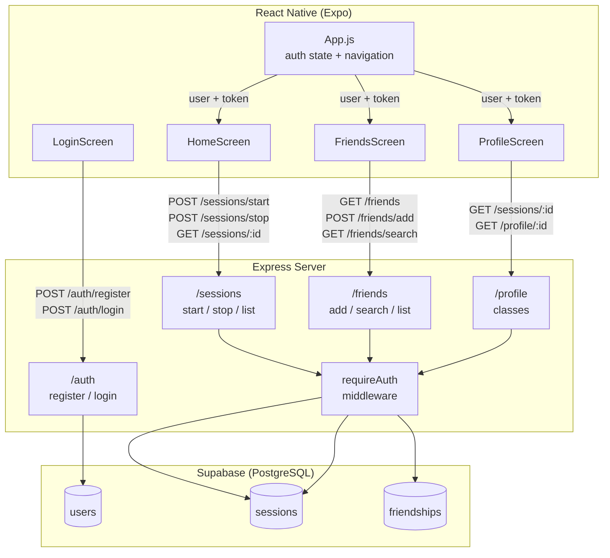
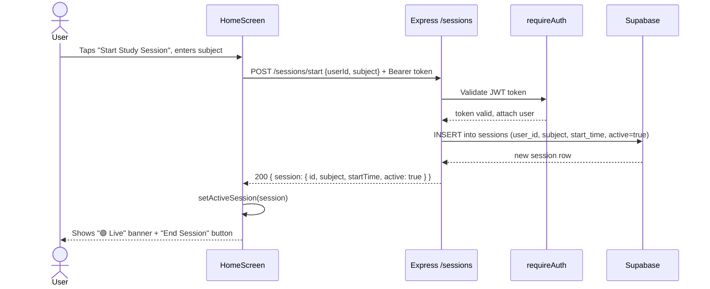

# Studia

Studia is a social productivity application designed to help university students track their academic efforts and build better study habits through peer accountability (friends).

## How to run the app locally

### Prerequisites

- Node.js
- npm
- Expo Go (for iOS testing)
- Supabase project credentials

### Backend

```bash
cd server
npm install
cp .env.example .env
```

Fill in the values in `.env`, then start the server:

```bash
npm start
```

### Frontend

```bash
cd frontend
npm install
cp .env.example .env
```

Fill in `EXPO_PUBLIC_API_URL`:

```env
EXPO_PUBLIC_API_URL=http://YOUR_LOCAL_IP:3000
```

Find your local IP:

```bash
ipconfig getifaddr en0
```

Start Expo:

```bash
npx expo start --tunnel
```

Open Expo Go on your iPhone and scan the QR code.


## Architecture

Diagram 1 uses a component graph to show the static structure: which modules exist and how data flows between layers. Diagram 2 uses a sequence diagram to show dynamic behavior which is the order of operations for a single user action that involves all three layers.

### Diagram 1 - System Component Overview

This diagram shows how the three layers of Studia communicate. 
The React Native frontend makes authenticated HTTP requests to the Express 
backend, which reads and writes to a Supabase (PostgreSQL) database.



---

### Diagram 2 - Start Study Session (Sequence Diagram)

This sequence diagram traces exactly what happens when a logged-in user 
taps "Start Study Session" in HomeScreen, from button press to the updated 
UI showing the active session.



### Diagram 3 - Adding Optional Study Notes to a Session (Sequence Diagram)

[UML Sequence Diagram.drawio (2).pdf](https://github.com/user-attachments/files/28655902/UML.Sequence.Diagram.drawio.2.pdf)


