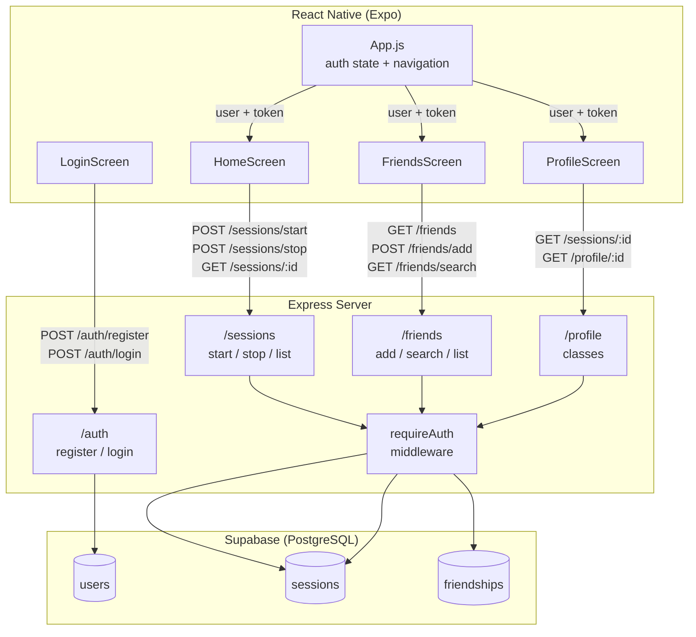
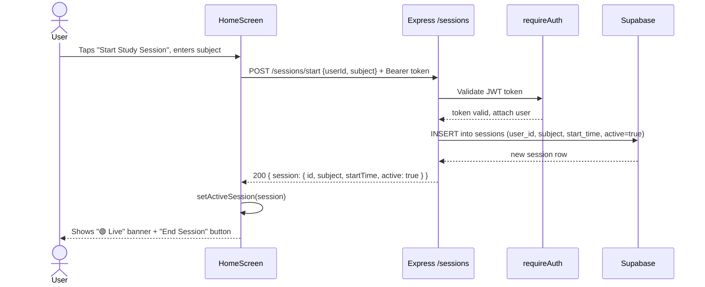
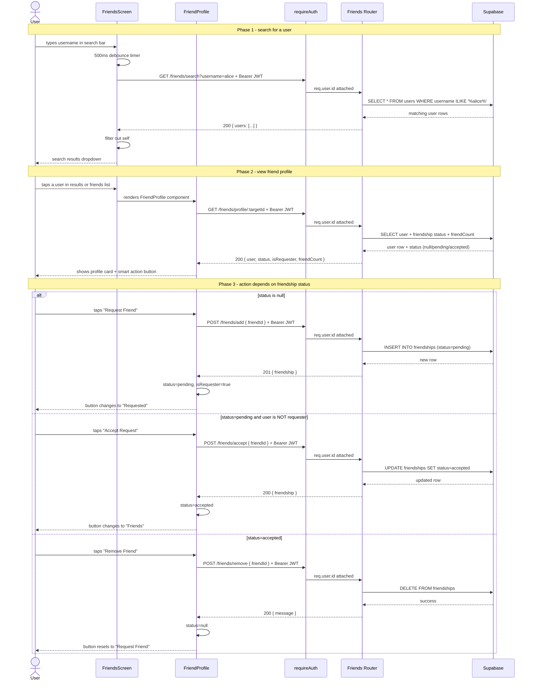

# Studia

Studia is a social productivity application designed to help university students track their academic efforts and build better study habits through peer accountability (friends).

## How to run the app locally

### Prerequisites
```md
For iPhone testing on restricted Wi-Fi, you can use ngrok to tunnel the backend. (Instructions below)
```
- Node.js
- npm
- Expo Go (for iOS testing)
- Supabase project credentials
- OPTIONAL: ngrok

### Backend

```bash
cd server
npm install
cp .env.example .env
```

Fill in the values in `.env`, then start the server:

```bash
npm start
```

### Frontend

```bash
cd frontend
npm install
cp .env.example .env
```

Fill in `EXPO_PUBLIC_API_URL`:

```env
EXPO_PUBLIC_API_URL=http://YOUR_LOCAL_IP:3000
```

Find your local IP:

```bash
ipconfig getifaddr en0
```

Start Expo:

```bash
npx expo start --tunnel
```

Open Expo Go on your iPhone and scan the QR code.

### Optional: Run on iPhone with ngrok

If your iPhone cannot reach your Mac directly on the local network, you can tunnel the backend with ngrok.

#### Install ngrok and connect your account

```bash
brew install ngrok/ngrok/ngrok
ngrok config add-authtoken YOUR_NGROK_AUTH_TOKEN
```

#### Start the backend

```bash
cd server
npm install
npm start
```

#### Open an ngrok tunnel for the backend

In a second terminal:

```bash
ngrok http 3000
```

Copy the HTTPS forwarding URL that ngrok shows, for example:

```text
https://abc123.ngrok-free.app
```

#### Update the frontend environment file

In `frontend/.env`, set:

```env
EXPO_PUBLIC_API_URL=https://YOUR_NGROK_URL
```

Replace `YOUR_NGROK_URL` with the HTTPS URL from ngrok.

#### Restart Expo

```bash
cd frontend
npx expo start --tunnel
```

Open Expo Go on your iPhone and scan the QR code.

#### Note

Ngrok URLs usually change each time you restart ngrok unless you have a reserved domain, so update `frontend/.env` whenever the URL changes.

## Architecture

Diagram 1 uses a component graph to show the static structure: which modules exist and how data flows between layers.
Diagrams 2 and 3 use sequence diagrams to show dynamic behavior which is the order of operations for key user flows that touch all three layers.

### Diagram 1 - System Component Overview

This diagram shows how the three layers of Studia communicate. 
The React Native frontend makes authenticated HTTP requests to the Express 
backend, which reads and writes to a Supabase (PostgreSQL) database.



---

### Diagram 2 - Start Study Session (Sequence Diagram)

This sequence diagram traces exactly what happens when a logged-in user 
taps "Start Study Session" in HomeScreen, from button press to the updated 
UI showing the active session.



### Diagram 3 - Friends: Search, Add, Accept, and Remove (Sequence Diagram)

This diagram shows the full friend workflow: searching for a user, viewing
their profile, and all possible actions (send request, accept request, or
remove friend).



### Diagram 4 - Adding Optional Study Notes to a Session (Sequence Diagram)

[UML Sequence Diagram.drawio (2).pdf](https://github.com/user-attachments/files/28655902/UML.Sequence.Diagram.drawio.2.pdf)


